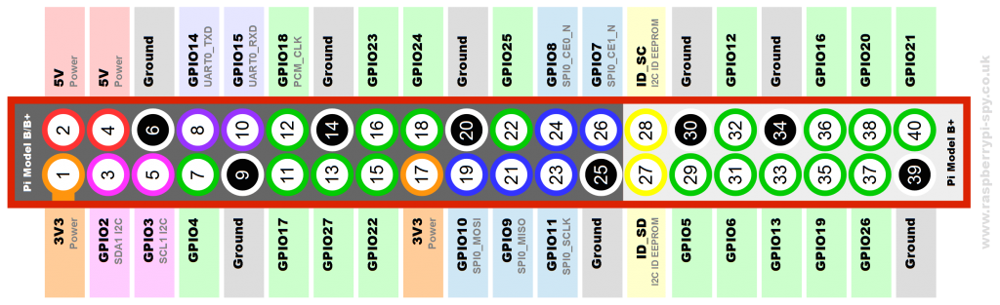

##Purpose

A Raspberry Pi computer and camera to continuously record video of small animals in their  cage.

## Features

 - Records video in 5 minute chunks, saving .h264 files into video/ folder.
 - Turns white light on during the day, 6 AM to 6 PM
 - Turns IR light on during the night, 6 PM to 6 AM
 - Optionally records temperature every 30 seconds (is this correct? Seems too much?)
 - Listens for triggering of 4 magnetic hall sensors (2 per wheel) and records to file. 

All events are logged to file in `/home/pi/video/`. The name of the log file is timestamp for when code is started (YYYYMMDD_HHMMSS.txt).

## Installation

### Requires a Raspberry Pi.

See [this post][1] to install a base Raspian system on a Raspberry Pi.

### Install screen
 
    sudo apt-get install screen
     
We need to use `screen` so the code continues to run even after the pi user logs out. Detach/exit `screen` sessions but keep the process running with ctrl+a then d.

### Required Python libraries

All code is written in Python using widely used libraries. Most of these Python libraries should already be installed by default. If libraries are missing, here are the required libraries.

    RPi.GPIO
    picamera
	Adafruit_DHT # requires install
	
#### Using a DHT22 temperature sensor

To use a [DHT22 temperature sensor][3], install the [Adafruit_DHT][2] library.

### Clone the homecageactivity github repository
    
    git clone https://github.com/cudmore/homecageactivity.git
    
## Running the code

    cd homecageactivity
    screen
    python video.py
    #exit screen with ctrl+a then d
    screen
    python testhome.py
    #exit screen with ctrl+a then d

## Returning to the running code

    #login as user pi using ssh
    #screen -r #gives a list of your two screen session
    screen -r xxx #to return to the first screen
    screen -r xxx #to return to the second screen session
    
The Python code can be stopped with `ctrl+c`.
  
## GPIO Pins

|Pin		|Goes To
|:-----		|:-----
|8			|5V Relay channel 1 (white light)
|7			|5V Relay channel 2 (IR light)
|
|17			|DHT22 Temperature/Humidity Sensor
|
|23			|Wheel 1, sensor 1
|24			|Wheel 1, sensor 2
|14			|Wheel 2, sensor 1
|15			|Wheel 2, sensor 2

This image is oriented as if pins on Raspberry Pi are in the top-left corner.

       
## Parts List

|Item									|Cost		|Link
|:-----									|:-----		|:-----
|Raspberry Pi Model B+/2/3				|$35		|[mcm electronics](http://www.mcmelectronics.com/content/en-US/raspberry-pi&?&gclid=Cj0KEQjwnv27BRCmuZqMg_Ddmt0BEiQAgeY1l6xF6o9AZdmy8KMorF1c5r6MKLaAhPFL6fchJ8r2XUUaAgCR8P8HAQ)
|5V >2A AC/DC Adapter					|$6			|[mcm electronics](http://www.mcmelectronics.com/product/28-19336)
|16GB SD Card (class 10)				|$8			|[amazon](https://www.amazon.com/s/?ie=UTF8&keywords=16+gig+class+10&tag=googhydr-20&index=aps&hvadid=110479542160&hvpos=1t1&hvexid=&hvnetw=g&hvrand=13177314294409354609&hvpone=&hvptwo=&hvqmt=b&hvdev=c&ref=pd_sl_3fv20t1iyw_b)
|
|Raspberry Pi NoIR Camera (5MP or 8MP)	|$30		|[adafruit](https://www.adafruit.com/products/3100)
|>1 meter ribbon cable for camera		|$3			|[adafruit](https://www.adafruit.com/products/1731)
|
|SainSmart 5V relay (2 channels)		|$10		|[sainsmart](http://www.sainsmart.com/arduino-pro-mini.html) or [amazon](https://www.amazon.com/SainSmart-101-70-100-2-Channel-Relay-Module/dp/B0057OC6D8)
|IR LEDS (make sure they are less than 900 nm)	|$1.15	|[link](http://www.mouser.com/ProductDetail/Vishay-Semiconductors/TSFF5210/?qs=%2Fjqivxn91ccEC8ExOpxzXA%3D%3D)
|White LED (single led or strip)		|$1 or $5		|[sparkfun single](https://www.sparkfun.com/products/531) or [mouser strip](http://www.mouser.com/ProductDetail/JKL-Components/ZM-1968-CW/?qs=KUIzHt%2Fe91klcUtDWfJwhA%3D%3D&gclid=Cj0KEQjwnv27BRCmuZqMg_Ddmt0BEiQAgeY1l4wLADWjvwtGyfVCdmIcRtSdBy2aHZ_GjnWzUa5ycMgaAgYv8P8HAQ)
|
|Low Profile Non Counting Running Wheels (Med Associates, ENV-044-02)	|	|		[link](http://www.med-associates.com/product/non-counting-running-wheel-for-mouse/)
|4x hall effect sensors					|$1			|[link](https://www.sparkfun.com/products/9312)
|4x 660 Ohm resistors (gold/brown/blue/blue)
|
|DHT22 Temperature and Humidity Sensor	|$10 or $2.50	|[adafruit](https://www.adafruit.com/products/385?gclid=Cj0KEQjwnv27BRCmuZqMg_Ddmt0BEiQAgeY1l1NmWl3j3_Q5uEAS-RAe3_luII1h8TaL2mgiaDXgFUYaAr_48P8HAQ) or [ali express](http://www.aliexpress.com/w/wholesale-dht22.html)
|
|Wood or [80/20 parts][4] to build frame
|Something to hold camera
|
|	|Total $120	|

## To Do

 - Done: Get rid of all reference to sql crap including bobsql. Just save everyhting in a local file.
 - Write simple plotting and analysis functions
 - Wrap code in web interface (video.py and home.py should be two seperate processes)
 
## Change log

 - 20160705 Rebuilding the system for Valerie. I erased the SD card on original Raspbery when installing Trigger Camera on Pi 3 for Zeng You. Copied from robertcudmore.org/raspberry/raspberrycam2/homecage.
 
 
[screen]: https://www.gnu.org/software/screen/
[1]: http://blog.cudmore.io/post/2016/05/21/raspian-jessie/
[2]: https://github.com/adafruit/Adafruit_Python_DHT
[3]: https://www.adafruit.com/products/385
[4]: https://www.8020.net
